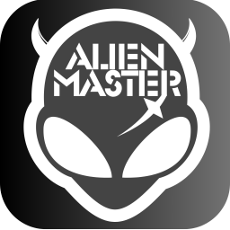

# ALien Worlds Project

> ข้อมูล: `สถานะ` กำลังในขั้นตอนการทดสอบระบบ

> info: `Status` Currently in the system testing phase

คลิกเพื่อดูวิธีการใช้งานเป็นภาษาไทย

## ขั้นตอนการสมัครสมาชิก
1. ลงทะเบียนเป็นสมาชิกที่ [https://alien-master.com](https://alien-master.com)
2. หากระบบขอรหัส OTP จะส่งไปยังอีเมลที่คุณใช้สำหรับการลงทะเบียน (หากคุณไม่ได้รับอีเมล โปรดตรวจสอบในโฟลเดอร์สแปมของคุณ)

## ขั้นตอนการดาวน์โหลดโปรแกรม
1. เข้าไปที่ GitHub > [Releases](https://github.com/Kittipob-K/alien-worlds-project/releases)
2. เลือกเวอร์ชันล่าสุดและดาวน์โหลดไฟล์โปรแกรมตามระบบปฏิบัติการของคุณ

...

| ระบบปฏิบัติการ | ไฟล์ |
| ------------ | ------------ |
| Windows 10/11 64 bit | .exe |
| MacOS | .dmg |
| Linux 64 bit | .AppImage |

...

## ขั้นตอนการเปิดใช้งานและลงทะเบียนโปรแกรม
1. เข้าสู่ระบบโปรแกรมด้วยบัญชีที่คุณลงทะเบียน
2. คัดลอกหมายเลขฮาร์ดแวร์ (Hardware ID) (พบใน Control Panel) และนำไปลงทะเบียนที่ [https://alien-master.com](https://alien-master.com)
3. เมื่อการลงทะเบียนสำเร็จ จำนวนเครดิตที่คุณมีจะปรากฏ
4. คุณสามารถเพิ่มบัญชี Wax เพิ่มเติมได้ (ไฟล์ .xlsx [https://shorturl.asia/UREm7](https://shorturl.asia/UREm7))

## ค่าบริการและการเติมเครดิต
- การเติมเครดิตสำหรับการใช้บริการสามารถทำได้ผ่านทาง 2 ช่องทาง:
   1. ผ่านระบบบล็อกเชน wax
   2. ผ่านรหัส QR โดยใช้ PromptPay (ระบบชำระเงินผ่านมือถือในประเทศไทย)
- ค่าบริการเป็น 10% ของยอดรายได้จากการขุด TLM ที่ได้รับในแต่ละธุรกรรม ระบบจะหักค่านี้ออกจากจำนวนเครดิตที่มีอยู่ในระบบ

Click to view How to use it in English

## Membership Registration Steps
1. Register as a member at [https://alien-master.com](https://alien-master.com).
2. If the system requests an OTP, it will be sent to the email address you used for registration. If you don't receive the email, please check your spam folder.

## Program Download Steps
1. Visit GitHub > [Releases](https://github.com/Kittipob-K/alien-worlds-project/releases).
2. Select the latest version and download the program file based on your operating system.

...

| Operating System | File |
| ------------ | ------------ |
| Windows 10/11 64 bit | .exe |
| MacOS | .dmg |
| Linux 64 bit | .AppImage |

...

## Program Activation and Registration Steps
1. Log into the program using your registered account.
2. Copy the Hardware ID (found in the Control Panel) and use it for registration at [https://alien-master.com](https://alien-master.com).
3. After completing the registration, the amount of credits you have will be displayed.
4. You can add additional Wax accounts (file .xlsx [https://shorturl.asia/UREm7](https://shorturl.asia/UREm7)).

## Service Fees and Credit Top-Up
- Top-up of credits for service usage can be done through 2 channels:
   1. Via the wax blockchain system
   2. Via the QR code using PromptPay (a mobile payment system in Thailand)
- The service fee is 10% of the TLM mining proceeds received in each transaction. The system deducts this fee from the available credit amount.

